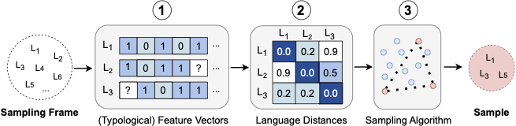

# A Principled Framework for Evaluating on Typologically Diverse Languages

<p align="center">
    
</p>

> **Abstract:**
> Beyond individual languages, multilingual natural language processing (NLP) research increasingly aims to develop models that perform well across languages generally. However, evaluating these systems on all the world’s languages is practically infeasible. To attain generalizability, representative language sampling is essential. Previous work argues that generalizable multilingual evaluation sets should contain languages with diverse typological properties. However, ‘typologically diverse’ language samples have been found to vary considerably in this regard, and popular sampling methods are flawed and inconsistent. We present a language sampling framework for selecting highly typologically diverse languages given a sampling frame, informed by language typology. We compare sampling methods with a range of metrics and find that our systematic methods consistently retrieve more typologically diverse language selections than previous methods in NLP. Moreover, we provide evidence that this affects generalizability in multilingual model evaluation, emphasizing the importance of diverse language sampling in NLP evaluation.

This repository contains the implementations, results and visualizations for the paper [*A Principled Framework for Evaluating on Typologically Diverse Languages*](https://arxiv.org/abs/2407.05022).
If you use any contents from this repository for your work, we kindly ask you to cite our paper:
```
@misc{ploeger2024principledframework,
      title={A Principled Framework for Evaluating on Typologically Diverse Languages},
      author={Esther Ploeger and Wessel Poelman and Andreas Holck Høeg-Petersen and Anders Schlichtkrull and Miryam de Lhoneux and Johannes Bjerva},
      year={2024},
      eprint={2407.05022},
      archivePrefix={arXiv},
      primaryClass={cs.CL},
      url={https://arxiv.org/abs/2407.05022},
}
```


# Installation and data
The package is tested with Python 3.10.

```sh
git clone https://github.com/esther2000/typdiv-sampling
cd typdiv-sampling
pip install .
```

Alternatively, with visualization support:
```sh
pip install ".[vis]"
```

Or for development:
```sh
pip install ".[dev]"
pre-commit install
pre-commit run --all-files
```

<br>

The data can be downloaded and prepared using the following script:

```sh
./prepare-data.sh
```

# Example usage

### Sampling
```python
from typdiv_sampling import Sampler
from pathlib import Path

# A list of glottocodes to sample from.
frame = ['stan1293', 'russ1263', 'finn1318', 'nucl1301', 'stan1290', 'kore1280']
k = 3  # The number of languages to sample.
seed = 1 # A random seed for the non-deterministic methods.

# Initialize with default setup.
sampler = Sampler(
    dist_path=dist_path,  # Language distances to use.
    gb_path=gb_path,  # Grambank csv file.
    wals_path=wals_path,  # WALS csv file.
    counts_path=counts_path,  # Convenience count file.
)
sampler.sample_maxsum(frame, k)
> ['kore1280', 'russ1263', 'stan1290']
```

Sampling methods include: `sample_maxsum()` (MaxSum), `sample_maxmin()` (MaxMin) and several baselines: `sample_random()`, `sample_convenience()`, `sample_random_family()`, `sample_random_genus()`.

An example of sampling usage in practice is found in: `evaluation/experiment.py`.


### Typological diversity evaluation
```python
from typdiv_sampling.evaluation import Evaluator

evaluator = Evaluator(
    gb_by_lang=gb_by_lang,  # Grambank feature vectors by language.
    dist_dict=dist_dict,  # Pairwise language distances as a dict.
)

sample = ['kore1280', 'russ1263', 'stan1290']
evaluator.evaluate_sample(sample)
> Result(
    run=None, # Optional result to keep track of averages across runs, unused here.
    ent_score_with=0.5374,
    ent_score_without=0.4954,
    fvi_score=0.7686,
    mpd_score=0.7836,
    fvo_score=0.6302,
    sample={'russ1263', 'kore1280', 'stan1290'},
)
```
An example of evaluation usage in practice is found in `use_cases/next-best.ipynb`.


## Reproducibility

The results and visualizations from the paper can be reproduced with the following scripts or notebooks:

* Language families and typological similarities (Figure 1, page 5): `analysis/typ-data-analysis.ipynb`
* Sampling algorithm visualization (Figure 2, page 10): `analysis/algo-vis.ipynb`
* Intrinsic evaluation graph (Figure 5, page 14): `evaluation/intrinsic-eval.sh`
* Intrinsic evaluation table (Table 1, page 15): `evaluation/tables/table.ipynb`
* Tokenization boxplots (Figure 6, page 16): `use_cases/tokenization/visualizations.ipynb`
* Dataset expansion results (Table 2, page 18): `use_cases/dataset_expansion/next-best.ipynb`
* UD expansion case study (Table 3, page 19): `use_cases/dataset_expansion/next-best.ipynb`
* Geographical distance plot (Figure 7, page 20):  `use_cases/geo_dist/visualize-dist.ipynb`

# Data Licenses
- [Grambank](https://grambank.clld.org/) is licensed under a [Creative Commons 4.0 BY International License](https://creativecommons.org/licenses/by/4.0/).
- [WALS](https://wals.info/) is licensed under a [Creative Commons 4.0 BY International License](https://creativecommons.org/licenses/by/4.0/).
- [Glottolog](https://github.com/glottolog/glottolog) is licensed under a [Creative Commons 4.0 BY International License](https://creativecommons.org/licenses/by/4.0/).

# License
The code and data in this repo are licensed under a [Creative Commons 4.0 BY International License](https://creativecommons.org/licenses/by/4.0/).
